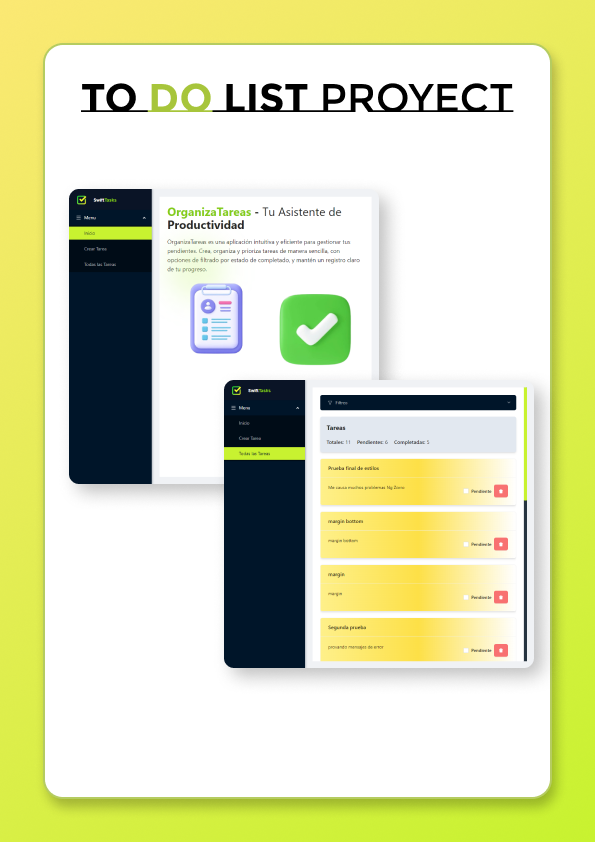

# To-Do List Application


## Project Description

This is a **simple To-Do List application** built with **Angular 14**. It provides full **CRUD functionality** (Create, Read, Update, Delete) to manage tasks efficiently. The app allows users to:

- **Create tasks** with a title and description.
- **Update the status** of tasks between pending and completed.
- **Delete tasks** from the list.
- **Filter tasks** by their status (pending, completed, or all).
- **Sort tasks** by creation date (newest first) with completed tasks displayed last.
- **Responsive design** for desktop and mobile devices using **Tailwind CSS**.
- **Simulated backend** using **json-server** for task persistence.
- **Counter of total**, pending and completed tasks.

---

## Features

- **Task Management**: Add, edit, delete tasks with status updates.
- **Filters**: Filter tasks by pending, completed, or view all tasks.
- **Sorting**: Tasks are sorted by creation date, with completed tasks moved to the bottom.
- **Responsive UI**: Works across different screen sizes, ensuring a great experience on mobile and desktop.
- **Animations**: Smooth animations for task transitions using **CSS keyframes**.
- **Counter**: Shows the number of total, pending and completed tasks.

---

## Technologies Used

- **Angular 14**
- **NG-Zorro (Ant Design for Angular)**
- **Tailwind CSS**
- **json-server** (for simulating a backend API)
- **RxJS** (for handling asynchronous operations)
- **TypeScript**

---

## Installation

### Prerequisites

- **Node.js** (v20 or superior)
- **npm** (comes with Node.js)
- **Angular CLI** (if not installed globally, use `npx`)

### Steps

1. **Clone the repository**:

```bash
   git clone https://github.com/your-username/to-do-list.git
   cd to-do-list
   ```
2. **Install dependencies**:

  ```bash
   npm install
   ```
3. **Run the json-server**:

  ```bash
   npm run start:json-server
   ```
4. **Run the Angular application**:

  ```bash
   ng serve
   ```
5. **Open the application**:

- **Open http://localhost:4200 in your browser to see the app.**

---

## Usage

1. **Create a task**: Use the "Create Task" button to add a new task with a title and description.
2. **Update task status**: Use the checkbox next to each task to mark it as completed or pending.
3. **Delete a task**: Click the delete button (trash icon) to remove a task.
4. **Filter tasks**: Use the filter menu to view all tasks, only pending tasks, or only completed tasks.
5. **Task Sorting**: Tasks are automatically sorted with the most recent tasks at the top, and completed tasks moved to the bottom.

---

## Project Structure

- `src/app/core`: Contains services and models (e.g., task model and task service).
- - `src/app/pages`: Contains pages such as the Welcome Page and Tasks Pages.
- `src/app/components`: Contains reusable components such as the task card and filter.
- `src/app/database/db.json`: A local JSON file used by **json-server** to simulate API responses.

---

## Contributing

Feel free to submit issues or contribute to the project by forking the repository and creating pull requests.

---

## License

Copyright (c) [2024] [Cristofer Angeles]

---

## Contact

For any questions or suggestions, feel free to reach out at **cristofer_alan123@hotmail.com**.


